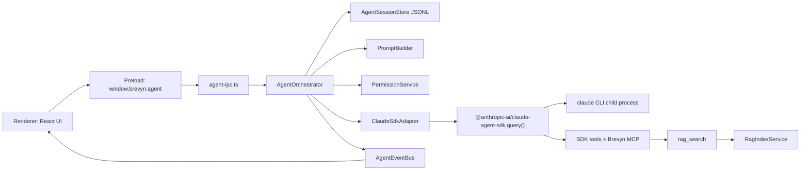

# Brevyn Agent SDK Setup

更新时间：2026-05-10

这份文档只描述 Claude Agent SDK 接入方案。总架构、业务存储、Provider、RAG、Skill 的完整背景见 `docs/architecture.md`。

## 目标

Brevyn 采用 Proma-style 桌面 Agent 架构，但第一版保持更薄：

- Claude Agent SDK 是唯一 Agent runtime，不接 OpenAI Agents。
- Agent provider 只走 Anthropic Messages 兼容协议。
- Embedding provider 只走 OpenAI-compatible embeddings。
- SQLite 只管 semester/course/task/thread/file metadata。
- Thread run/event 真源是 JSONL，不放 SQLite。
- Renderer 只显示 timeline、composer、approval，不执行模型、文件、shell、RAG。

第一版要打通的闭环：

1. 用户在 task thread 或 semester home thread 里发送消息。
2. Main process 解析 thread workspace cwd、provider、skills、RAG tool。
3. Claude Agent SDK 在 main process 下 spawn claude CLI 子进程。
4. SDK message 流写入 thread JSONL，并通过 IPC 推送 renderer。
5. Renderer 展示 assistant timeline、tool activity、approval card。
6. 刷新应用后从 JSONL replay 完整 thread timeline。

## 当前可复用地基

现有代码已经具备这些接线点：

| 能力 | 当前实现 | SDK 接入时怎么用 |
| --- | --- | --- |
| Agent provider | `ProviderService.agentProvider()` | 选唯一启用的 Anthropic-compatible provider |
| SDK env | `AnthropicAgentAdapter.buildSdkEnv()` | 生成 `ANTHROPIC_API_KEY` / `ANTHROPIC_AUTH_TOKEN` / `ANTHROPIC_BASE_URL` |
| Thread cwd | `workspacePathForThread()` | 作为 SDK `cwd` |
| JSONL path | `threadMessagesPath()` | 作为 Brevyn thread event 真源 |
| Skills | `SkillFileStore` + `formatEnabledSkillPrompt()` | run 启动时注入 system prompt |
| RAG | `FileService.searchRag()` / `RagIndexService` | 包成 `rag_search` MCP tool |
| IPC | typed `window.brevyn` bridge | 新增 `window.brevyn.agent.*` |
| Provider presets | `AGENT_PROVIDER_PRESETS` | Anthropic / DeepSeek / Kimi API / Kimi Coding 走同一 SDK adapter |

不要新增重复的 ShellService / EditService / GitService。Claude Agent SDK 已经提供 `Read`、`Write`、`Edit`、`Glob`、`Grep`、`Bash`、`TodoWrite` 等本地工具。

## 进程架构



边界：

- `agent-ipc.ts` 只做参数校验和薄转发。
- `AgentOrchestrator` 只管 run lifecycle、并发、停止、错误和事件路由。
- `ClaudeSdkAdapter` 只包 SDK `query()` 和子进程 spawn。
- `AgentSessionStore` 只管 JSONL append/read/replay。
- `PermissionService` 只管 `canUseTool` 决策和 approval pending state。
- `PromptBuilder` 只管 system prompt / dynamic context。
- `ToolRegistry` 只注册 Brevyn 自建 MCP tools，MVP 只有 `rag_search`。

## 本地目录

业务数据根目录继续使用：

```text
~/.brevyn-dev/   # dev
~/.brevyn/       # prod
```

SDK 接入后新增：

```text
~/.brevyn-dev/
  sdk-config/               # CLAUDE_CONFIG_DIR，隔离用户全局 ~/.claude
  semesters/
    <semesterId>/
      threads/
        <threadId>.jsonl    # Brevyn thread event truth
```

启动时设置：

```ts
process.env.CLAUDE_CONFIG_DIR = join(rootDataDir, "sdk-config");
```

不要临时切换 `process.env.CLAUDE_CONFIG_DIR`。Proma 的经验是：这个变量应在 runtime 初始化时一次性设置，避免并发 run 期间被互相污染。

## 依赖安装

`package.json`：

```json
{
  "dependencies": {
    "@anthropic-ai/claude-agent-sdk": "^0.x"
  },
  "optionalDependencies": {
    "@anthropic-ai/claude-agent-sdk-darwin-arm64": "^0.x",
    "@anthropic-ai/claude-agent-sdk-darwin-x64": "^0.x",
    "@anthropic-ai/claude-agent-sdk-win32-x64": "^0.x",
    "@anthropic-ai/claude-agent-sdk-win32-arm64": "^0.x"
  }
}
```

打包注意：

- `asar: false` 或确保 SDK native CLI 可被执行。
- esbuild main bundle 要把 `@anthropic-ai/claude-agent-sdk` 设为 external，运行时 dynamic import。
- Node/Git 不打包，后续做 runtime detection；第一版可以先只要求系统已有可用环境。

## 新增文件

```text
src/main/agent/
  agent-orchestrator.ts
  agent-event-bus.ts
  agent-session-store.ts
  claude-sdk-adapter.ts
  permission-service.ts
  prompt-builder.ts
  tool-registry.ts
  sdk-spawn-helper.ts

src/main/ipc/
  agent-ipc.ts

src/renderer/components/agent/
  AgentTimeline.tsx
  ApprovalCard.tsx
  ToolActivityItem.tsx

src/renderer/components/chat/
  Composer.tsx
  MessageBubble.tsx
  EmptyThreadPanel.tsx

src/renderer/lib/
  timeline.ts
  run-status.ts
```

## IPC 合约

新增 `window.brevyn.agent`：

```ts
agent: {
  messages(threadId: string): Promise<BrevynAgentEvent[]>;
  run(input: AgentRunInput): Promise<{ runId: string }>;
  stop(threadId: string): Promise<boolean>;
  approve(input: AgentApprovalInput): Promise<boolean>;
  reject(input: AgentApprovalInput): Promise<boolean>;
  onEvent(callback: (event: BrevynAgentEvent) => void): () => void;
}
```

MVP 输入：

```ts
interface AgentRunInput {
  threadId: string;
  prompt: string;
}

interface AgentApprovalInput {
  requestId: string;
  threadId: string;
}
```

IPC channel 建议：

```ts
agentMessages: "brevyn:agent:messages"
agentRun: "brevyn:agent:run"
agentStop: "brevyn:agent:stop"
agentApprove: "brevyn:agent:approve"
agentReject: "brevyn:agent:reject"
agentEvent: "brevyn:agent:event"
```

## JSONL Event Model

Renderer 不依赖 SDK 原始格式。SDK message 先映射成 Brevyn event，再写 JSONL 和推 UI：

```ts
type BrevynAgentEvent =
  | { type: "run_started"; runId: string; threadId: string; createdAt: string }
  | { type: "user_message"; runId: string; threadId: string; messageId: string; content: string; createdAt: string }
  | { type: "assistant_message"; runId: string; threadId: string; messageId: string; content: string; createdAt: string }
  | { type: "tool_started"; runId: string; threadId: string; toolCallId: string; toolName: string; input: unknown; createdAt: string }
  | { type: "tool_finished"; runId: string; threadId: string; toolCallId: string; output: unknown; createdAt: string }
  | { type: "approval_requested"; runId: string; threadId: string; requestId: string; toolName: string; input: unknown; createdAt: string }
  | { type: "approval_resolved"; runId: string; threadId: string; requestId: string; decision: "allow" | "deny"; createdAt: string }
  | { type: "response_metrics"; runId: string; threadId: string; usage?: unknown; createdAt: string }
  | { type: "run_completed"; runId: string; threadId: string; createdAt: string }
  | { type: "run_failed"; runId: string; threadId: string; error: string; createdAt: string };
```

规则：

- `user_message` 必须在 SDK run 前先写入 JSONL。
- SDK 每条完整 message 都追加 JSONL。
- approval request / resolved 必须追加 JSONL。
- `run_failed` 也必须追加 JSONL，不能只 toast。
- JSONL 写失败时中止 run；不能继续产生不可 replay 的 UI 状态。

## SDK Adapter

`ClaudeSdkAdapter` 包装 `query()`：

```ts
const sdk = await import("@anthropic-ai/claude-agent-sdk");
const stream = sdk.query({
  prompt: userPrompt,
  options: {
    pathToClaudeCodeExecutable: resolveSdkCliPath(),
    model: provider.selectedModel,
    cwd,
    env: adapter.buildSdkEnv(provider, apiKey),
    systemPrompt,
    abortController,
    canUseTool,
    allowedTools: ["Read", "Glob", "Grep", "TodoWrite", "rag_search"],
    disallowedTools: ["WebSearch", "Task"],
    mcpServers,
    includePartialMessages: false,
    toolUseConcurrency: 1,
    settingSources: ["user", "project"],
    spawnClaudeCodeProcess: trackedSpawn,
  },
});
```

Provider 差异只在 `AnthropicAgentAdapter` 里解决：

- Anthropic：`ANTHROPIC_API_KEY`
- DeepSeek：`ANTHROPIC_API_KEY` + `ANTHROPIC_BASE_URL=https://api.deepseek.com/anthropic`
- Kimi API：`ANTHROPIC_API_KEY` + `ANTHROPIC_BASE_URL=https://api.moonshot.cn/anthropic`
- Kimi Coding：`ANTHROPIC_AUTH_TOKEN` + `ANTHROPIC_BASE_URL=https://api.kimi.com/coding/v1` + custom headers

Agent runtime 不再自己判断 DeepSeek/Kimi 细节。

## Orchestrator Run Flow

```text
run(input)
  validate threadId + prompt
  load thread metadata from SQLite
  reject if thread/course/semester archived
  resolve cwd via workspacePathForThread()
  resolve agent provider via ProviderService.agentProvider()
  resolve api key from ProviderSecretStore/env
  build system prompt
  create runId + AbortController
  append user_message + run_started JSONL
  emit events to renderer
  start sdk query()
  for each SDK message:
    map to BrevynAgentEvent
    append JSONL
    emit renderer event
  append run_completed or run_failed
  cleanup active run state + pending approvals
```

并发策略：

- 同一个 `threadId` 同一时间只允许一个 active run。
- 第二次 run 如果前一个还在跑，直接报错：`This thread is already running.`
- `stop(threadId)` 先 `abortController.abort()`，再强杀 PID 兜底。

## Process Management

SDK 子进程治理要从第一版就做，避免 Electron 退出后残留 claude 进程：

- 自定义 `spawnClaudeCodeProcess`。
- 每次 spawn 记录 `{ threadId, runId, pid }`。
- `child.stderr` 必须 consume，避免 64KB stderr buffer 卡死子进程。
- stop 时先 abort，再 kill pid。
- app `before-quit` 遍历 active pid set 全部 kill。
- 退出兜底扫描当前进程派生的 `claude-agent-sdk` 子进程并强杀。

## Permission Model

MVP 两个模式：

| 模式 | 行为 |
| --- | --- |
| `review` | 读类工具 allow；写文件、Bash、WebFetch 需要 approval |
| `full` | workspace 内写入可 allow；危险命令、外部路径仍 approval |

默认策略：

| Tool | 默认 |
| --- | --- |
| `Read` / `Glob` / `Grep` / `TodoWrite` | allow |
| `rag_search` | allow |
| `Write` / `Edit` | approval |
| `Bash` | approval，读类命令可白名单 |
| `WebFetch` | approval |
| `WebSearch` | deny |
| `Task` | deny，MVP 不启用 sub-agent |

approval UI 支持：

- allow once
- deny
- always allow in this session

危险操作不允许 always allow：

- 删除文件
- 外部路径写入
- 跨课程路径
- `git push`
- `git reset --hard`
- `git clean`
- destructive shell command

## Prompt Builder

system prompt 包含：

- Brevyn Agent 角色：学习、课程、文件、RAG、写作/复习/项目辅助。
- 当前 semester/course/task/thread metadata。
- 当前 cwd。
- 启用 skills 的摘要。
- RAG 使用说明：回答课程材料问题前优先 `rag_search`。
- 文件边界：默认只在当前 thread cwd 内读写。
- 引用规则：RAG evidence 要带 citation。

不要在 system prompt 塞大量文件全文。文件内容由 SDK `Read/Grep` 或 `rag_search` 按需取。

## Tool Registry

MVP 只做：

```ts
rag_search({
  query: string,
  courseId?: string,
  taskId?: string,
  topK?: number
})
```

返回：

```ts
{
  results: Array<{
    title: string;
    citation: string;
    excerpt: string;
    score: number;
    source: string;
  }>
}
```

scope 规则：

- task thread 默认限制到当前 course/task 相关材料。
- semester home thread 可以搜当前 semester 内课程材料，但返回时要带 course/title。
- archived course/thread 禁止 run，自然不会触发 tool。

## Renderer MVP

第一版 UI 不做 Proma 的 fork/team/rewind，只做稳定时间线：

- `Composer`：输入、发送、停止。
- `AgentTimeline`：从 JSONL replay + live events 合并展示。
- `MessageBubble`：user / assistant。
- `ToolActivityItem`：tool started / finished。
- `ApprovalCard`：allow / deny。
- `RunIndicators`：running / failed / stopped。

数据流：

```text
App.tsx selectedThreadId
  -> agent.messages(threadId) replay
  -> agent.onEvent live subscribe
  -> sendMessage calls agent.run()
  -> stop calls agent.stop()
```

切 thread 时必须取消旧 subscription，避免旧 thread event 写到新 thread UI。

## Roadmap

### Stage 1 — Dependency + Runtime Bootstrap

- 安装 SDK 包和 native optional packages。
- 设置 `CLAUDE_CONFIG_DIR`。
- 加 `src/main/agent/` 空骨架。
- 加 IPC/preload/type skeleton。

验收：`npm run typecheck && npm run build`。

### Stage 2 — JSONL Session Store

- 实现 append/read/replay。
- `threads.create` 时不需要创建 JSONL，首次 run append 时创建。
- `threads.delete` 显式删除 JSONL。

验收：手工 append/read 能 replay；坏 JSON 行要跳过或返回清晰错误，不静默吞整文件。

### Stage 3 — SDK Run

- 实现 `ClaudeSdkAdapter.query()`。
- 实现 `AgentOrchestrator.run/stop`。
- 接 `ProviderService.agentProvider()`。
- 写 `run_started/user_message/assistant_message/run_completed/run_failed`。

验收：一个 thread 能发消息并 replay。

### Stage 4 — RAG Tool + Prompt + Permission

- 注册 `rag_search`。
- prompt 注入 skills/course/task/cwd。
- approval card 闭环。

验收：Agent 能查课程资料；写文件/Bash 会弹 approval。

### Stage 5 — Renderer Timeline

- 做 composer/timeline/tool/approval UI。
- App.tsx 接 live subscription。
- settings provider ready 状态接入 agent runtime。

验收：完整 UI 跑通，刷新后 timeline 不丢。

## 不做项

第一版明确不做：

- fork session
- rewind file checkpoint
- multi-agent team
- external MCP settings marketplace
- free chat thread
- long-term memory
- OpenAI Agents runtime
- 自建 shell/edit/git tools

这些等课程 thread + JSONL + SDK + RAG + approval 稳定后再评估。

