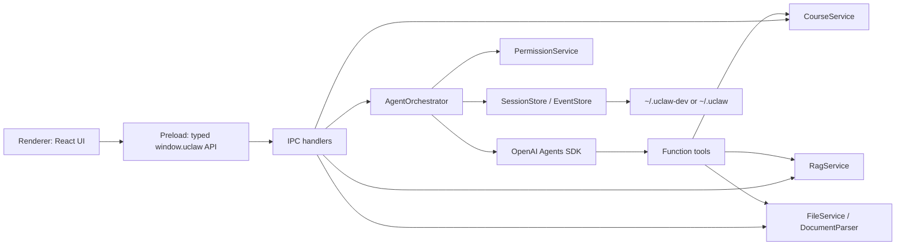
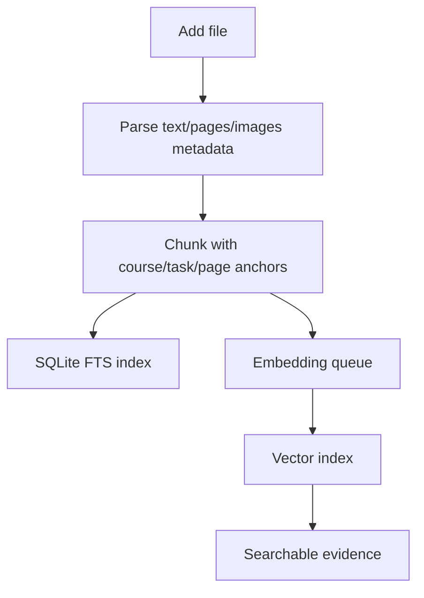
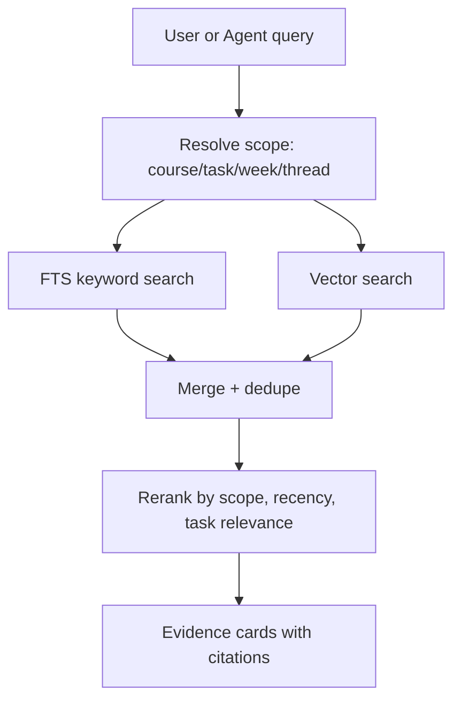

# UCLAW Electron Architecture Draft

更新时间：2026-05-06

## 结论

UCLAW Electron 版建议采用 Proma 风格的桌面架构，但把业务核心从“通用 Agent 工作区”改成“课程工作区 + 本地 RAG + 学业任务 Agent”。

核心方向：

- 保留现有 UCLAW UI 的信息架构和视觉语言。
- 不依赖当前 FastAPI 后端，先做 Electron 本地优先版本。
- Electron main process 作为可信运行时 harness，负责存储、课程业务、文件解析、RAG、Agent 编排、权限和 IPC。
- Renderer 只负责 React UI、状态展示、用户交互和流式事件渲染。
- OpenAI Agents SDK 用于 Agent loop、streaming、tools、handoffs、guardrails、human review 和 tracing。
- Responses API 保留为底层模型能力认知，不直接作为业务主编排层。

## 为什么参考 Proma

Proma 已经验证了一套适合桌面 Agent 产品的结构：

- Electron + Vite + React + Tailwind。
- 主进程服务层拆分清楚：AgentOrchestrator、SessionManager、WorkspaceManager、PermissionService、AttachmentService、DocumentParser。
- IPC 作为唯一跨进程边界：类型定义 -> main handler -> preload bridge -> renderer API。
- 本地优先存储：配置、会话索引、JSONL 消息、工作区文件都在用户目录。
- Agent 运行不塞进 UI，主进程负责事件流、持久化、错误恢复和权限判断。

UCLAW 不应照搬 Proma 的通用 Agent 产品形态，而应复用它的运行时分层。

## 产品边界

### 需要覆盖

- Course：课程、学期、教师、课程描述、颜色/图标。
- Task：assignment、project、exam、lecture/work item。
- Files：课件、reading、assignment spec、rubric、past paper、student draft。
- Threads：home thread、course thread、task thread。
- RAG Search：按课程、任务、周次、文件类型、当前线程范围检索。
- Agent：课程问答、作业写作辅助、项目规划、考试复习、文件整理。
- Approval：写文件、删除文件、运行命令、跨课程读取等敏感动作需要确认。

### 暂不覆盖

- 不接当前 FastAPI API。
- 不做云同步。
- 不做多用户协作。
- 不做 WeChat/Feishu 远程桥，先保留架构扩展点。
- 不把所有业务都交给 OpenAI 托管向量库；本地 RAG 是默认路径。

## 进程架构



Renderer 不直接访问 OpenAI、文件系统或数据库。所有敏感能力都经过 main process。

## 目录建议

```text
apps/uclaw-electron/
  package.json
  src/
    main/
      index.ts
      ipc.ts
      services/
        agent-orchestrator.ts
        agent-session-store.ts
        run-event-stream.ts
        timeline-normalizer.ts
        skill-service.ts
        mcp-service.ts
        course-service.ts
        task-service.ts
        file-service.ts
        document-parser.ts
        rag-service.ts
        edit-service.ts
        git-service.ts
        shell-service.ts
        permission-service.ts
        dialog-service.ts
        context-window-service.ts
        settings-service.ts
        channel-service.ts
      tools/
        rag-tools.ts
        course-tools.ts
        file-tools.ts
        edit-tools.ts
        git-tools.ts
        shell-tools.ts
      storage/
        paths.ts
        json-store.ts
        event-log.ts
        sqlite-store.ts
    preload/
      index.ts
    renderer/
      App.tsx
      components/
        agent/
          AgentTimeline.tsx
          ToolActivityItem.tsx
          ToolApprovalCard.tsx
          ContextTokenRing.tsx
      atoms/
      lib/
        agent-events.ts
        timeline.ts
      styles/
  docs/
    architecture.md
```

## 本地存储

建议采用“三层存储”，但不能把 SQLite 当唯一真源：

1. JSON/JSONL 作为 source of truth：semester/course/task/file 的可读配置可以落 JSON；Agent 运行信息必须落 JSONL。
2. SQLite 作为 projection/query cache：负责列表查询、筛选、FTS、最近状态、UI projection，可以从 JSON/JSONL 重建。
3. LanceDB 作为本地向量索引：只存 chunk embedding 和 vector metadata，不承担业务关系查询，也不替代 SQLite。

Proma 的纯 JSON/JSONL 方案很适合 Agent 产品，因为它可读、可回放、可迁移。UCLAW 额外有学期切换、课程文件、检索、chunk、embedding、citation、deadline projection，所以需要 SQLite 帮 UI 和检索做稳定查询，但 SQLite 不是不可替代的事实层。LanceDB 专注 RAG semantic search。

```text
~/.uclaw-dev/
  settings.json
  channels.json
  semesters/
    <semesterId>/
      semester.json
      shared/
      courses/
        <courseId>/
          Course shared/
          Week/
            Week 1/
            Week 2/
          Task/
            Assignment/
              <taskId-or-title>/
                Materials/
                Drafts/
                Submitted/
            Exam/
              <taskId-or-title>/
                Materials/
                Drafts/
                Submitted/
      threads/
        <threadId>.jsonl
  indexes/
    uclaw.sqlite
    lance/
    fts/
```

学期切换的语义是切换 `currentSemesterId`。Renderer 重新读取当前学期下的 courses、tasks、threads、files、timetable、indexing jobs，不跨学期混合展示。

```text
semester
  -> courses
  -> tasks
  -> sessions/threads
  -> files
  -> rag indexes
```

SQLite 表建议从这些 projection 开始，全部允许从 JSON/JSONL 重建：

```text
semesters(id, semester_no, term, folder_name, starts_at, ends_at, source, recognized_at)
courses(id, semester_id, name, code, instructor, meeting_time, location, color)
tasks(id, semester_id, course_id, title, task_type, status, due_at, summary)
threads_projection(id, semester_id, course_id, task_id, thread_type, title, updated_at, latest_run_status, latest_event_seq)
files(id, semester_id, course_id, task_id, section_kind, week_number, task_file_bucket, source_path, path, kind, updated_at)
chunks(id, semester_id, course_id, task_id, file_id, page, text, citation, token_count)
indexing_jobs(id, semester_id, course_id, section_id, status, embedding_model, progress)
```

Agent 部分的真源必须是 JSONL：

```text
threads/<threadId>.jsonl
  {"type":"user_message", ...}
  {"type":"assistant_message_delta", ...}
  {"type":"assistant_message_done", ...}
  {"type":"tool_call_started", ...}
  {"type":"tool_call_completed", ...}
  {"type":"tool_output_delta", ...}
  {"type":"tool_approval_required", ...}
  {"type":"approval_resolved", ...}
  {"type":"ask_user_requested", ...}
  {"type":"context_snapshot", ...}
  {"type":"response_metrics", ...}
  {"type":"run_status_changed", ...}
```

规则：

- Renderer replay、断线恢复、timeline 展示都读 JSONL 事件语义。
- SQLite 的 `threads_projection` 只存 latest status、latest seq、title、updatedAt 等摘要。
- approval / ask-user 不能只存在内存或 SQLite，必须追加 JSONL。
- 如果 SQLite 损坏或 schema 迁移失败，可以丢弃 SQLite 并从 JSON/JSONL 重建。

旧的单文件 JSON mock store 只适合当前 UI 阶段；一旦开始做真实 Agent、文件解析、RAG indexing 和跨学期切换，就应该拆成 JSON/JSONL 真源 + SQLite projection。

```text
Legacy JSON shape, only for prototype:
courses/
  <courseId>/
      course.json
      files/
      skills/
      mcp.json
      tasks/
        <taskId>/
          task.json
          workspace/
      threads/
        <threadId>.jsonl
```

## RAG 设计

RAG 不应该只是“向量搜索”。课程场景需要可解释、可过滤、可引用。

### Ingest pipeline



### Search pipeline



### MVP 策略

- MVP 先做 FTS + simple chunk citations，保证离线可用。
- Phase 2 加 embedding/vector provider。
- Phase 3 可选 OpenAI hosted file_search/vector stores，但必须是用户显式开启的云端能力。

## Agent 架构

建议先做一个主 Agent，再逐步拆 specialist。

### MVP Agent

`Course Workspace Agent`

职责：

- 读取当前 course/task/thread context。
- 调用 `search_course_materials` 查 RAG。
- 调用 `list_tasks`、`get_task_detail`、`list_files` 理解课程结构。
- 输出答案时带 evidence/citation。
- 对写文件、改 draft、删除文件、运行命令走 approval。

### 后续 specialist

- `Course Tutor`：课程内容解释。
- `Assignment Coach`：读 assignment spec/rubric，辅助结构和草稿。
- `Exam Coach`：生成复习卡、mock questions、薄弱点清单。
- `File Librarian`：整理文件、识别归属、补 metadata。
- `Planning Agent`：deadline、week plan、study schedule。

这些可以用 Agents SDK handoffs，也可以把 specialist 暴露成 tools，让主 Agent 保持用户回复控制权。

## Agent 基础能力

UCLAW 不是普通 Chat UI。即使第一版只服务课程业务，也应该保留完整 Agent 桌面产品骨架。

### Skills

Skills 是课程/工作区级能力包，用来给 Agent 注入稳定的方法、提示词和工具说明。

建议结构：

```text
~/.uclaw-dev/
  default-skills/
    assignment-coach/
      SKILL.md
    exam-review/
      SKILL.md
    citation-helper/
      SKILL.md
  courses/
    <courseId>/
      skills/
        assignment-coach/
          SKILL.md
      skills-inactive/
```

SkillService 负责：

- 列出、启用、禁用、导入、编辑 skill。
- 读取 `SKILL.md` frontmatter 和正文。
- 按 course/task/thread scope 注入相关 skill。
- 支持用户在输入框中 `@skill` 或自然语言指定 skill。
- 记录 skill 版本和启用状态，方便重建上下文。

第一版内置 skills：

- `assignment-coach`：理解 assignment spec、rubric、草稿结构。
- `exam-review`：生成复习计划、题目卡、弱点清单。
- `citation-helper`：把 RAG evidence 转成可引用段落。
- `file-librarian`：识别课件/reading/作业文件归属。
- `study-planner`：根据 task/deadline 生成计划。

### MCP

MCP 是可选扩展层，不是课程核心路径。每个 course/workspace 可以有自己的 `mcp.json`。

McpService 负责：

- 读写 workspace MCP 配置。
- 测试 MCP server 是否可用。
- 为 AgentOrchestrator 构造 SDK 可用的 MCP server/tool 配置。
- 支持启用/禁用、allowed tools、环境变量引用。

MVP 不需要远程 MCP，但要先把接口留好。未来可以接 GitHub、Notion、Canvas、Google Drive、Zotero、Mendeley。

### Git、编辑和命令

UCLAW 需要具备基础代码/文本工作区 Agent 能力，尤其是项目课和论文草稿。

建议拆成三层：

- `EditService`：读文件、写文件、局部替换、生成 diff、应用 patch。
- `GitService`：检测 repo、status、diff、log、branch、commit、restore preview。
- `ShellService`：运行受控命令，处理 cwd、env、timeout、输出截断。

对应 function tools：

- `read_workspace_file`
- `write_workspace_file`
- `apply_workspace_patch`
- `list_workspace_files`
- `git_status`
- `git_diff`
- `git_log`
- `git_commit`
- `run_shell_command`

权限原则：

- 读文件、`git status`、`git diff`、`git log` 默认允许。
- 写文件和 apply patch 在 `review` 模式必须弹 approval，approval card 要展示 path 和 diff preview。
- `git commit` 可以在用户明确要求时 approval 后执行。
- `git push`、`git reset`、`git clean`、`git rebase`、删除文件、跨课程路径、外部路径必须单独 approval。
- 所有 shell command 必须非交互、可超时、可取消，并记录到 thread event log。

不要让 Renderer 直接执行 git 或 shell。Agent 只能通过 main process tools 间接执行。

### Dialog / Ask User

Agent 不应该只能用聊天文本问用户。需要有结构化对话框能力：

- approval dialog：允许/拒绝工具调用。
- ask-user dialog：多选/单选/短文本，让 Agent 在缺关键信息时暂停。
- file picker dialog：导入课件、草稿、rubric。
- save/open location dialog：选择课程工作区或导出位置。
- context warning dialog：上下文接近上限时，让用户选择压缩、移除附件、缩小 RAG 范围。
- settings dialog：渠道、模型、API key、代理、RAG provider。

DialogService 只负责发出结构化请求和等待 UI 响应。Renderer 负责展示。

### Context Window Detection

上下文窗口检测必须是一等功能。课程材料、附件、RAG evidence、tool results 很容易把上下文撑爆。

ContextWindowService 负责：

- 维护 model catalog：model id、input context、output reserve、是否支持 reasoning/streaming/tools。
- 估算 thread history、system prompt、skills、RAG evidence、attachments、tool outputs 的 token 占用。
- 运行前生成 context budget report。
- 流式运行后读取 SDK/result usage 或 raw model usage，更新真实消耗。
- 在接近阈值时触发压缩、裁剪或用户选择。

预算建议：

```text
available_input
  - system_prompt
  - active_skills
  - recent_thread_history
  - selected_course_context
  - rag_evidence
  - attachments
  - tool_output_budget
  - output_reserve
= safety_margin
```

策略：

- 低于 70%：正常运行。
- 70%-90%：减少 RAG topK、压缩旧消息、截断长 tool output。
- 超过 90%：运行前提示用户选择“压缩历史 / 缩小范围 / 移除附件”。
- prompt-too-long 或 SDK context error：自动写入失败事件，生成可恢复建议，不丢用户输入。

OpenAI Agents SDK 的 session 和 result state 可以帮助 continuation 和 paused run resume，但 UCLAW 仍然要保留自己的 context report，保证 UI 可解释。

## SSE 对话流和 Timeline

UCLAW 现有 TaskAgent 已经有接近 Codex 的流式体验：一边流 assistant message，一边流 timeline item。Electron 版应该保留这个交互合同，而不是退化成普通聊天气泡。

### Stream boundary

当前 Web 版是：

```text
POST /chat/runs
GET /chat/runs/{runId}/events/stream
  -> text/event-stream
  -> event: taskagent_item
  -> data: TaskAgentStreamItem
```

Electron 版没有 FastAPI 后端，但仍应保留 SSE 风格的事件 envelope：

```ts
type RunStreamEnvelope = {
  event: "uclaw_run_item" | "uclaw_runtime_event" | "uclaw_runtime_ping";
  data: UclawRunStreamItem;
};
```

实际传输可以是：

- main -> renderer：IPC event channel，默认实现。
- local dev/debug：可选本地 HTTP SSE endpoint，方便复用现有 `EventSource` 调试和回放工具。

关键是事件语义保持 SSE-compatible：有 `runId`、`threadId`、`seq`、`type`，客户端可用 `afterSeq` replay durable items，再接 live events。

### Run item types

第一版保留 UCLAW 现有 item 类型，并扩展 OpenAI Agents SDK 映射：

```ts
type UclawRunStreamItemType =
  | "turn_started"
  | "context_snapshot"
  | "attachments_loaded"
  | "assistant_message_delta"
  | "assistant_message_done"
  | "tool_call_started"
  | "tool_call_completed"
  | "tool_approval_required"
  | "tool_output_delta"
  | "reasoning_summary_delta"
  | "reasoning_summary_done"
  | "context_compaction"
  | "response_metrics"
  | "run_status_changed"
  | "ask_user_requested"
  | "error";
```

映射规则：

- OpenAI SDK raw text delta -> `assistant_message_delta`。
- final answer settled -> `assistant_message_done`。
- function tool start/done -> `tool_call_started` / `tool_call_completed`。
- approval interruption -> `tool_approval_required`。
- shell stdout/stderr chunk -> `tool_output_delta`。
- reasoning summary/raw model reasoning summary -> `reasoning_summary_delta` / `reasoning_summary_done`。
- run usage -> `response_metrics`。
- run state transition -> `run_status_changed`。

`RunEventStream` 必须先写 JSONL，再发 live event。Renderer 断线后用 `afterSeq` 补齐，不依赖内存。

### Timeline model

Renderer 不直接展示 SDK 原始事件，而是先归一化成 timeline item：

```ts
type TimelineTone = "thinking" | "tool" | "meta" | "final";

type TimelineItem = {
  id: string;
  kind:
    | "thinking_delta"
    | "thinking_done"
    | "tool_start"
    | "tool_result"
    | "tool_approval"
    | "tool_output_delta"
    | "attachments_loaded"
    | "context_compaction"
    | "run_status_changed"
    | "error";
  phase: string;
  title: string;
  detail: string;
  status: string;
  tone: TimelineTone;
  toolCall?: ToolCallView;
  approval?: ApprovalRequestView;
  payload?: Record<string, unknown>;
};
```

`timeline-normalizer.ts` 负责把 run item 转成稳定 UI item。这里可以直接迁移现有 UCLAW 的 `frontend/lib/taskagent/timeline.ts` 思路。

### Codex-style activity groups

Timeline UI 要用 Codex 风格的紧凑活动流：

- thinking：显示“正在思考”，使用现有 `taskagent-sweep-text` 轻扫文字效果。
- explore：读文件、列目录、搜索 workspace、RAG、web search 合并成“正在浏览 / 已浏览”。
- skill：`list_taskagent_skills`、`read_taskagent_skill` 合并成 “Loaded skills / Loaded skill”。
- edit：`apply_patch`、`write_workspace_file`、move/delete/create directory 合并成“正在编辑 / 已编辑”，详情展示 changed files 和 diff stats。
- run：shell/git command 合并成“正在运行命令 / 已运行命令”，展开后显示 stdout/stderr。
- approval：永远展开，显示确认卡，不被折叠。
- meta：attachments、context compaction、error、run status 用低权重展示。

交互规则：

- assistant text delta 一出现，timeline 默认折叠，避免抢主回答焦点。
- approval 出现时，timeline 自动展开并滚到底部。
- live run 没有 thinking item 时，展示一个主动的“正在思考”占位。
- completed 后保留 timeline，挂在 assistant message 下，默认折叠。
- failed/cancelled 时保留 error timeline，方便复盘。

### Existing UI pieces to migrate

可以直接参考并迁移这些 UCLAW 现有模块：

- `frontend/lib/taskagent/run-events.ts`：stream item 类型和 run status patch。
- `frontend/lib/taskagent/timeline.ts`：tool summary、timeline normalize、persisted replay。
- `frontend/app/workspace/page.tsx` 中的 `TaskAgentTimeline`、`TimelineActivityGroup`、`ToolApprovalCard`、`ContextTokenPopover`。
- `frontend/app/globals.css` 中的 `taskagent-sweep-text`、`taskagent-panel-content-in`、tab run tone 动画。

迁移时要拆小组件，避免继续放在一个超大 page 文件里。

## IPC 合约草案

```ts
window.uclaw.courses.list()
window.uclaw.courses.create(input)
window.uclaw.skills.list(courseId)
window.uclaw.skills.toggle(courseId, skillId, enabled)
window.uclaw.skills.read(courseId, skillId)
window.uclaw.skills.write(courseId, skillId, content)
window.uclaw.mcp.getConfig(courseId)
window.uclaw.mcp.saveConfig(courseId, config)
window.uclaw.tasks.list(courseId, filters)
window.uclaw.files.import(courseId, filePaths, destination)
window.uclaw.rag.search(input)
window.uclaw.git.status(workspaceId)
window.uclaw.git.diff(workspaceId, options)
window.uclaw.context.estimate(input)
window.uclaw.threads.create(input)
window.uclaw.threads.getEvents(threadId)
window.uclaw.runs.getEvents(runId, afterSeq)
window.uclaw.runs.subscribe(runId, afterSeq, callback)
window.uclaw.agent.run(input)
window.uclaw.agent.stop(runId)
window.uclaw.agent.approve(approvalId)
window.uclaw.agent.reject(approvalId)
window.uclaw.agent.respondAskUser(requestId, answers)
window.uclaw.agent.onEvent(callback)
```

Renderer 只订阅 `agent.onEvent`，不自己拼 tool state。

## Agents SDK 和 Responses API 的区别

### Responses API 是底层能力

Responses API 是 REST endpoint。它适合直接创建模型响应，支持文本/图片/文件输入、流式输出、function calling、web search、file search 等 hosted tools。

如果我们直接用 Responses API 做 Codex-like runtime，就需要自己实现：

- agent loop：模型输出 tool call 后继续调用。
- tool dispatch：解析参数、执行工具、回填结果。
- approval pause/resume：保存中断状态，用户批准后继续同一轮。
- session/memory：维护 history、previous response id、压缩和恢复。
- handoff：多 Agent 所有权切换。
- tracing/observability：自己映射事件。

它的好处是控制最细，坏处是我们要自己维护大量 orchestration 代码。

### Agents SDK 是编排层

Agents SDK 是 TypeScript/Python 的 code-first agent toolkit。官方文档给它的定位是：当应用自己拥有 orchestration、tool execution、approvals、state 时使用 SDK。

它提供：

- `Agent` 定义。
- `run()` / streaming run。
- function tools。
- sessions / conversation continuation。
- handoffs。
- guardrails。
- human review interruptions。
- tracing。

重点：Agents SDK 不会替我们做课程业务、文件系统权限、RAG index、UI 状态或本地存储。它解决的是模型运行循环和 Agent 编排原语。

### 对 UCLAW 的实际差异

| 维度 | 直接用 Responses API | 用 Agents SDK |
| --- | --- | --- |
| 抽象层级 | 低层 API | 高层编排 SDK |
| Tool loop | 自己写 | SDK runner 管 |
| Streaming | 原始 response events | SDK stream events，底层仍可看到 raw model events |
| Approval | 自己建 pending state | SDK 有 interruptions/state resume 模型 |
| Handoff | 自己实现 | SDK 原生支持 |
| Session | 手动 previous_response_id/history | SDK session/conversation 策略 |
| RAG | 调 hosted file_search 或自定义 function | 同样可调 hosted/file/custom tools，但挂在 Agent 上 |
| 本地文件权限 | 必须自己做 | 仍然必须自己做 |
| 可移植性 | 更容易换其他 OpenAI-compatible API | 更偏 OpenAI SDK 生态 |
| 开发速度 | 慢，代码多 | 快，更适合现在重做 Electron |

## 推荐决策

UCLAW Electron 版默认使用 OpenAI Agents SDK，不直接手写 Responses API loop。

但代码结构必须保留 adapter：

```text
AgentOrchestrator
  -> AgentRuntimeAdapter
      -> OpenAIAgentsAdapter
      -> FutureResponsesAdapter
      -> FutureLocalModelAdapter
```

这样我们先用 Agents SDK 快速建立正确产品行为，同时避免把课程业务绑死到某个 SDK。

## OpenAI 能力边界

### 用 OpenAI Agents SDK 做

- agent loop
- streaming
- tool calls
- handoffs
- guardrails
- human review pause/resume
- trace visibility

### 我们自己做

- course/task/thread domain
- local file ingest
- document parsing
- local search/index
- permission policy
- JSONL event truth
- SQLite projections
- UI runtime state
- citation rendering

### 可选 OpenAI hosted 能力

- web search：用户开启后可用。
- file search/vector stores：适合云端同步或大文档托管，但不是本地优先默认值。
- Code Interpreter / containers：后续需要运行代码或生成 artifacts 时再评估。

## Event model

AgentOrchestrator 应把 SDK 事件映射成 UCLAW 自己的事件，不让 Renderer 依赖 SDK 原始格式。

```ts
type UclawAgentEvent =
  | { type: "run_started"; runId: string; threadId: string }
  | { type: "assistant_delta"; runId: string; text: string }
  | { type: "assistant_done"; runId: string; messageId: string; content: string }
  | { type: "tool_started"; runId: string; toolCall: ToolCallView }
  | { type: "tool_finished"; runId: string; toolCall: ToolCallView }
  | { type: "tool_output_delta"; runId: string; toolCallId: string; stream: "stdout" | "stderr"; chunk: string }
  | { type: "approval_requested"; runId: string; approval: ApprovalRequestView }
  | { type: "ask_user_requested"; runId: string; request: AskUserRequestView }
  | { type: "context_report"; runId: string; report: ContextBudgetReport }
  | { type: "response_metrics"; runId: string; metrics: ResponseMetricsView }
  | { type: "git_state_changed"; workspaceId: string; status: GitStatusView }
  | { type: "run_completed"; runId: string; finalMessageId: string }
  | { type: "run_failed"; runId: string; error: string };
```

这和 Proma 的事件总线思路一致，也方便未来把 SDK 换掉。

## 权限模型

先保留 UCLAW 当前两个模式：

- `review`：读自动允许；写文件、删文件、shell、跨课程/外部路径需要 approval。
- `full`：课程工作区内写入和普通操作可直接执行；外部路径仍需要 approval。

Agents SDK 可以表达“工具需要 human review”，但最终 allow/deny 逻辑应该在 UCLAW `PermissionService`。

权限请求要支持三种 UI 决策：

- allow once：只允许这一次 tool call。
- deny：拒绝这一次，并把拒绝结果回填给 Agent。
- always allow in session：只对当前 session 生效，不写全局永久白名单。

危险操作不提供 always allow。

## 第一阶段切法

1. 搭 Electron/Vite/React/Tailwind 基础工程。
2. 移植现有 UCLAW UI 外观：Sidebar、Dashboard、Course、Task workspace、Chat panel、Approval card。
3. 建本地 Course/Task/Thread mock store。
4. 接 IPC + JSONL event store。
5. 加 SkillService/McpService 的最小 UI 和本地文件结构。
6. 加 GitService/EditService/ShellService 的只读能力和 diff preview。
7. 做 FTS RAG MVP：导入文件、解析文本、搜索、citation。
8. 接 OpenAI Agents SDK，暴露 `search_course_materials` function tool。
9. 做 approval / ask-user / context-warning UI 闭环。
10. 加 ContextWindowService 的运行前估算和运行后 usage 记录。

## 参考资料

- OpenAI Agents SDK: https://developers.openai.com/api/docs/guides/agents
- Running agents: https://developers.openai.com/api/docs/guides/agents/running-agents
- Guardrails and human review: https://developers.openai.com/api/docs/guides/agents/guardrails-approvals
- Tools in the Agents SDK: https://developers.openai.com/api/docs/guides/tools#usage-in-the-agents-sdk
- Agents results and state: https://developers.openai.com/api/docs/guides/agents/results
- Agents session memory/context management: https://developers.openai.com/cookbook/examples/agents_sdk/session_memory
- Responses API endpoint: https://api.openai.com/v1/responses
- Proma reference: `docs/Proma-main/AGENTS.md`
