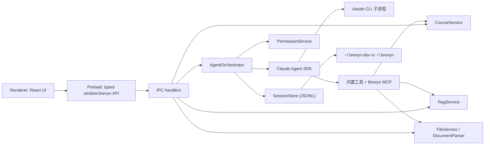
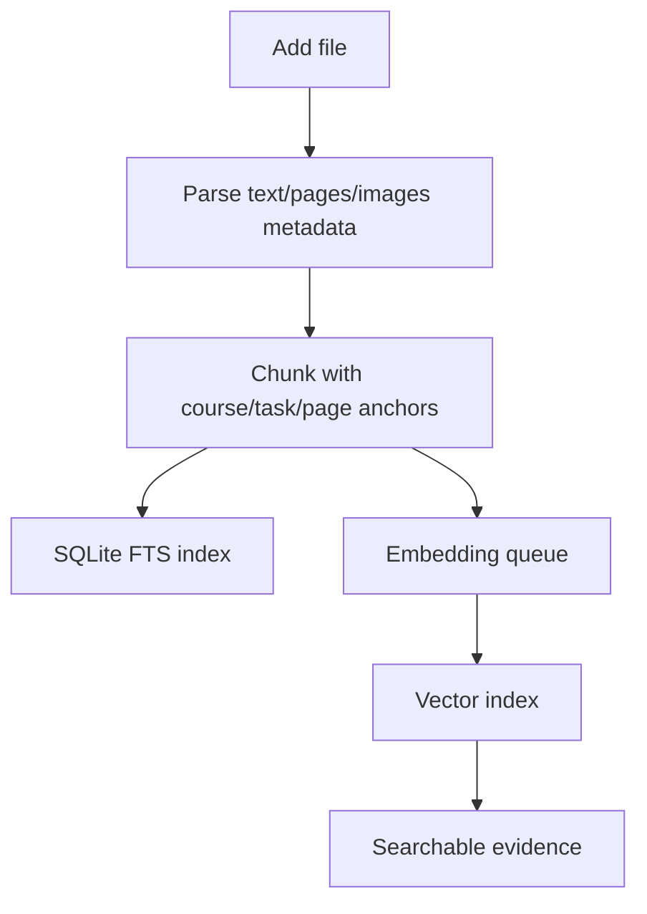
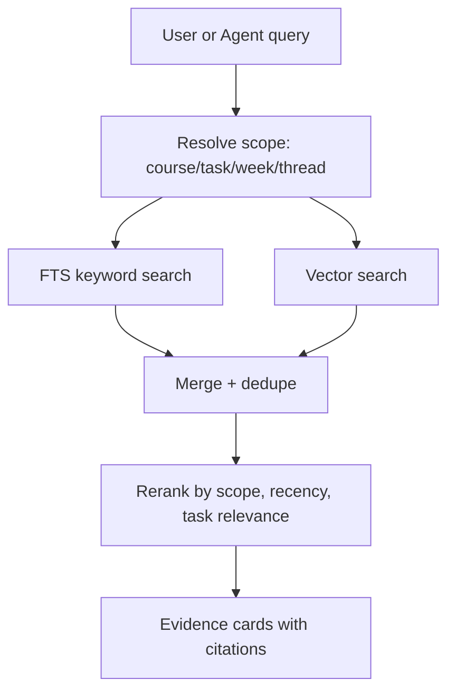

# Brevyn Electron Architecture Draft

更新时间：2026-05-31

## 结论

Brevyn Electron 版建议采用 Proma 风格的桌面架构，但把业务核心从“通用 Agent 工作区”改成“课程工作区 + 本地 RAG + 学业任务 Agent”。

核心方向：

- 保留现有 Brevyn UI 的信息架构和视觉语言。
- 不依赖当前 FastAPI 后端，先做 Electron 本地优先版本。
- Electron main process 作为可信运行时 harness，负责存储、课程业务、文件解析、RAG、Agent 编排、权限和 IPC。
- Renderer 只负责 React UI、状态展示、用户交互和流式事件渲染。
- Claude Agent SDK（`@anthropic-ai/claude-agent-sdk`）用于 Agent loop、streaming、tools、permissions 和 human review。SDK 在 main 进程内 spawn 一个 claude CLI 子进程，Brevyn 通过 `query()` 接口与之交互，并由 Brevyn 自己把 session 事件追加写入 JSONL。
- Provider 协议分两条：chat 走 Anthropic Messages（含国产兼容层 DeepSeek `/anthropic`、Kimi `/coding/v1`、智谱 GLM-4.6 等），embedding 走 OpenAI-compatible embedding endpoint（DashScope / 自部署 bge-m3 等）；两者完全独立配置，分别启用，不混用 provider 记录。

## 为什么参考 Proma

Proma 已经验证了一套适合桌面 Agent 产品的结构：

- Electron + Vite + React + Tailwind。
- 主进程服务层拆分清楚：AgentOrchestrator、SessionManager、WorkspaceManager、PermissionService、AttachmentService、DocumentParser。
- IPC 作为唯一跨进程边界：类型定义 -> main handler -> preload bridge -> renderer API。
- 本地优先存储：配置、会话索引、JSONL 消息、工作区文件都在用户目录。
- Agent 运行不塞进 UI，主进程负责事件流、持久化、错误恢复和权限判断。
- Proma 也使用 Claude Agent SDK，验证了 Anthropic 协议路线在桌面 Agent 产品里的可行性，特别是国产 provider（DeepSeek、Kimi、智谱）通过 Anthropic 兼容层接入的模式。Brevyn 直接复用 Proma 的 SDK 调用模板和 baseUrl 规范化逻辑。

Brevyn 不应照搬 Proma 的通用 Agent 产品形态，而应复用它的运行时分层和 Claude SDK 接入方式。

## 产品边界

### 需要覆盖

- Course：课程、学期、教师、课程描述、颜色/图标。
- Task：assignment、project、exam、lecture/work item。
- Files：课件、reading、assignment spec、rubric、past paper、student draft。
- Dashboards：Semester/Home Dashboard 作为学期入口；Course Dashboard 作为课程入口；Task workspace 承载具体 Agent 对话。
- Threads：Home session、task session。Course container 只承载课程文件、课件资料和任务，不创建 course-level session。
- RAG Search：按课程、任务、周次、文件类型、当前线程范围检索。
- Agent：课程问答、作业写作辅助、项目规划、考试复习、文件整理。
- Approval：写文件、删除文件、运行命令、跨课程读取等敏感动作需要确认。

### 当前 UI 入口语义

Brevyn 当前不把“课程”本身设计成聊天容器。默认入口是 dashboard，再由 dashboard 引导用户进入更明确的工作区：

- 选择学期 Home 时，主区域显示 Semester Dashboard；用户可以从这里进入跨课程 Home session、课程看板或最近任务。
- 选择某门课程但未选择任务时，主区域显示 Course Dashboard；用户可以查看课件资料、任务进展、活动热力图和建议下一步。
- 选择任务或显式打开 thread 时，才进入 Agent Thread Panel。
- Workspace scaffold 可以自动恢复学期/课程/任务文件夹，但 session/thread 必须由用户显式创建。
- 文件浏览器 rail 默认收起，避免新打开应用时右侧被文件树占据；上传文件后会展开文件栏，点击 inline 文件/预览路径会展开预览栏。

Dashboard 统计当前是过渡型 metadata-based 统计，不引入额外事件流水表：

- 文件活动来自 `workspace_files.updated_at`。
- 会话活动来自 `threads.updated_at`。
- 课件文件由 `section_kind === "lecture"` 识别。
- 草稿文件由 `task_file_bucket === "drafts"` 或路径中的 `/drafts/` 识别。
- 热力图只表示“文件与会话活动”，不是严格学习时长或真实写作贡献。

后续如果要做更准确的学习/写作统计，再新增 `activity_events` / `daily_activity_summary` / `draft_metrics` 这类聚合表；当前阶段不做，避免前端操作链路被统计写入拖复杂。

### 暂不覆盖

- 不接当前 FastAPI API。
- 不做云同步。
- 不做多用户协作。
- 不做 WeChat/Feishu 远程桥，先保留架构扩展点。
- 不把所有业务都交给 OpenAI 托管向量库；本地 RAG 是默认路径。

## 进程架构



Renderer 不直接访问 OpenAI、文件系统或数据库。所有敏感能力都经过 main process。

## 目录建议

```text
apps/brevyn-electron/
  package.json
  src/
    main/
      index.ts
      ipc/
        index.ts
        workspace-ipc.ts             # semester/course/task/thread/git 薄 handler
        files-ipc.ts                 # files tree/import/delete/reveal 薄 handler
        indexing-ipc.ts              # indexing jobs + rag search 薄 handler
        provider-ipc.ts              # provider profiles 薄 handler
        skills-ipc.ts                # SKILL.md 文件层薄 handler
        timetable-ipc.ts             # timetable range 薄 handler
      agent/                          # 新增：agent runtime 全部聚合在这
        agent-orchestrator.ts         # run lifecycle、并发守卫、错误恢复
        agent-event-bus.ts            # main 内部事件总线（main → renderer）
        agent-session-store.ts        # JSONL 会话真源（追加/读取/replay）
        permission-service.ts         # canUseTool 回调实现
        prompt-builder.ts             # system prompt 拼装（含 skill 注入、course/task 上下文）
        claude-sdk-adapter.ts         # 包 @anthropic-ai/claude-agent-sdk 的 query()
        sdk-spawn-helper.ts           # 自定义 spawn + PID 跟踪 + 孤儿清理
        tool-registry.ts              # Brevyn 自建 function tools（MVP 只注册 rag_search）
      services/
        workspace-service.ts          # 从 local-store 拆出：semester/course/task/thread
        file-service.ts               # 从 local-store 拆出：文件树、导入、预览、sections
        workspace-file-tree.ts        # 纯函数：文件树 projection / section folder 构造
        workspace-state.ts            # 纯读 helper：current active semester / archive 判断
        workspace-paths.ts            # 纯函数：路径推导 / workspace dir 创建
        provider-config-store.ts      # provider-profiles.json 配置真源
        provider-secret-store.ts      # API key 的 safeStorage 加密
        rag-index-service.ts          # LanceDB + embedding 调用
      storage/
        sqlite-business-store.ts      # SQLite 业务表
      indexing/                        # 索引队列（worker_threads + durable queue）
      skills/                          # SKILL.md 文件层
    preload/
      index.ts
    renderer/
      App.tsx
      components/
        chat/                          # MessageBubble / Composer / EmptyThreadPanel / Markdownish
        agent/                         # AgentTimeline / ApprovalCard / ToolActivityItem
        courses/                       # CourseManagementDialog / CourseDashboard / SemesterDashboard
        files/                         # FileBrowserRail / FilePreviewRail / 上传对话框
        settings/                      # SettingsDialog（chat + embedding 两套独立编辑器）
        shell/                         # AppTitleBar / TopBar / WorkspaceSidebar / TaskTypeIcon
        timetable/                     # TimetableDialog
        status/                        # RunIndicators
      hooks/
        useWorkspaceSessionController.ts
        useWorkspaceLayoutState.ts
        useWorkspaceFilesState.ts
      lib/
        cn.ts
        timeline.ts                    # SDK message → TimelineItem 归一化（简化版）
        run-status.ts                  # status 工具
        workspace-files.ts
      styles/
  docs/
    architecture.md
```

不在本期范围（之前过度设计的 service，全部从目录里删掉）：`git-service.ts` / `shell-service.ts` / `dialog-service.ts` / `channel-service.ts` / `mcp-service.ts` / `edit-service.ts` —— 这些能力 Claude Agent SDK 自带 Read/Write/Edit/Bash/Glob/Grep 等内置工具，Brevyn 不再自建。

## 本地存储

Electron 的 `userData` 目录只放窗口状态、Chromium cache、崩溃日志这类 App 外壳数据：

```text
~/Library/Application Support/Brevyn Dev/   # 开发模式
~/Library/Application Support/Brevyn/       # 正式版本
```

业务真源不放 `Application Support`，统一放在用户主目录，方便备份、迁移、Agent SDK/CLI 访问，并与 Proma 的 `~/.proma-dev` / `~/.proma` 模式保持一致：

```text
~/.brevyn-dev/   # 开发模式
~/.brevyn/       # 正式版本
```

当前采用“三层存储”，其中 SQLite 是课程业务 metadata 的实际存储，Agent 运行日志仍然坚持 JSONL 真源：

1. SQLite 作为 business store：负责 semester/course/task/thread/workspace_files/timetable/indexing_jobs。
2. JSONL 作为 Agent run/session truth：messages、timeline、tool calls、approval、metrics 都追加写 thread JSONL。
3. LanceDB 作为本地向量索引：只存 chunk embedding 和 vector metadata，不承担业务关系查询，也不替代 SQLite。

Proma 的纯 JSON/JSONL 方案很适合通用 Agent 产品，因为它可读、可回放、可迁移。Brevyn 额外有学期切换、课程文件、检索、chunk、embedding、citation、deadline projection，所以课程业务直接落 SQLite；Agent 事件保留 JSONL，方便回放和审计。LanceDB 专注 RAG semantic search。

```text
~/.brevyn-dev/
  provider-profiles.json
  provider-secrets.json
  semesters/
    <semesterId>/
      Semester shared/
      courses/
        <courseId>/
          Course shared/
          Lecture/
          Task/
            <taskId>__<taskTitle>/
              Materials/
              Drafts/
              Submitted/
      threads/
        <threadId>.jsonl
  indexes/
    brevyn.sqlite
    rag/
  sdk-config/        # Claude Agent SDK 接入后用于隔离 CLAUDE_CONFIG_DIR
```

学期切换的语义是切换 `currentSemesterId`。`currentSemesterId` 是显式选择态；如果为空或指向归档/不存在的学期，业务读路径返回空状态或明确报错，不隐式 fallback 到“第一个学期”。Renderer 重新读取当前学期下的 courses、tasks、threads、files、timetable、indexing jobs，不跨学期混合展示。

```text
semester
  -> courses
  -> tasks
  -> sessions/threads
  -> files
  -> rag indexes
```

SQLite 业务表从这些开始。`src/main/storage/sqlite-business-store.ts` 是全新 baseline；不再读取 `brevyn-state.json`，不做 legacy JSON 导入，也不在读路径里自动 seed / repair 业务数据。Provider 不在 SQLite，`providers` 表启动时会被删除：

```text
semesters(id, semester_no, term, folder_name, starts_at, ends_at, source, recognized_at, archived_at, raw_json)
courses(id, semester_id, name, code, instructor, schedule_json, folder_name, workspace_kind, archived_at, raw_json)
tasks(id, semester_id, course_id, title, task_type, status, due_at, raw_json)
threads(id, semester_id, course_id, task_id, title, status, archived_at, raw_json)
workspace_files(id, semester_id, course_id, task_id, parent_id, section_kind, week_number, task_file_bucket, source_path, path, kind)
timetable_events(id, semester_id, course_id, task_id, title, kind, source, starts_at, ends_at)
indexing_jobs(id, semester_id, course_id, section_id, status, stage, embedding_model, indexed_files, total_files, completed_files, progress, error)
indexing_tasks(id, job_id, semester_id, course_id, section_id, file_id, kind, status, attempts, max_attempts, locked_by, locked_until, next_run_at, progress, error, payload_json)
rag_chunks(id, semester_id, course_id, section_id, file_id, file_name, file_path, source_path, kind, week_number, task_file_bucket, chunk_index, chunk_count, text, citation, vector)
```

索引队列采用本地成熟方案：SQLite durable queue 负责持久化、恢复、取消、重试和进度；main process 的 `IndexingQueueService` 只做调度；`worker_threads` 执行解析/chunk 这类 CPU 工作；`RagIndexService` 负责把 chunk 调 OpenAI-compatible embedding endpoint，再写入 LanceDB。现在的 worker 先支持 md/txt/code 的文本解析和 chunk 统计，PDF/DOCX/PPTX/image 会生成明确 warning，后续再接更完整的 parser adapter 和更细的速率控制。

Provider 配置不再放 SQLite 业务库，单独由 `provider-profiles.json` + `provider-secrets.json` 管。`provider-profiles.json` 是唯一配置真源；SQLite 不迁、不读、不写、不 fallback：

- `purpose` 取值：`agent` 或 `embedding`，运行时硬隔离。
- Agent provider 只允许 `protocol: "anthropic_messages"`。
- Embedding provider 只允许 `protocol: "openai_compatible"`。
- 运行模型统一由 `selectedModel` + `models[]` 表达。
- `authMode` 取值：`api_key`、`auth_token` 或 `bearer`。
- Agent 工具能力由 Claude Agent SDK 内置 + Brevyn MCP server 提供，无需 provider 级开关。

Settings UI 提供两套独立的 provider 编辑器：一套用于添加/编辑 Agent Provider，一套用于添加/编辑 Embedding Provider。新增配置只预选当前支持的 protocol，不预填 URL / key / model。

Agent run/event 的真源必须是 JSONL。Thread metadata 由 SQLite 管，消息文件路径不存 SQLite，由 `threadMessagesPath(rootDataDir, semesterId, threadId)` 推导：

```text
semesters/<semesterId>/threads/<threadId>.jsonl
  {"type":"user_message", ...}
  {"type":"assistant_message_delta", ...}
  {"type":"assistant_message_done", ...}
  {"type":"tool_call_started", ...}
  {"type":"tool_call_completed", ...}
  {"type":"tool_output_delta", ...}
  {"type":"tool_approval_required", ...}
  {"type":"approval_resolved", ...}
  {"type":"context_snapshot", ...}
  {"type":"response_metrics", ...}
  {"type":"run_status_changed", ...}
```

规则：

- Renderer replay、断线恢复、timeline 展示都读 JSONL 事件语义。
- SQLite 的 `threads` 只存 thread metadata：`semester_id`、`course_id`、`task_id`、`title`、`status`、`archived_at`、`created_at`、`updated_at` 和扩展 `raw_json`。
- JSONL 路径是派生缓存路径，不是业务真源，不允许 UI 或外部输入覆盖。
- approval 不能只存在内存或 SQLite，必须追加 JSONL。
- 如果 SQLite 损坏或 schema 迁移失败，thread metadata 需要从备份或显式修复流程恢复；不要在启动时静默根据 JSONL 自动重建 session。
- 显式删除 thread/task/course/semester 时可以删除对应 JSONL；启动清理孤儿 JSONL 应谨慎，优先 quarantine 而不是静默 rm。

Session 创建规则：

- Workspace scaffold 可以自动 ensure：学期目录、`Semester shared`、`courses`、course 文件夹、task 文件夹都可以恢复。
- Session/thread 必须由用户显式创建；workspace scaffold 只能建目录和文件树，不能自动创建 Home session。
- Home session 是普通 session，可以归档和永久删除；没有系统保护线程。
- 非 Home 的 session 必须绑定 task，禁止 course container session。
- 选择 Home/course container 时默认展示 dashboard，不自动选择或创建 thread。
- 归档只隐藏和 ban 使用；永久删除必须先归档。删除 course/task/semester 时，如果有 active indexing job，先阻止删除，等索引完成后再删。

Agent 工作区记忆规则：

- `CLAUDE.md` 位于当前 Agent cwd。Home cwd 是 `Semester shared`，任务 cwd 是具体 task 目录；它是 Home/task 级长期记忆，同一工作区下所有会话共享。Brevyn 不自动创建，只允许用户或 Agent 在确有稳定规则、偏好或可复用知识时创建。
- `.brevyn/sessions/<threadId>/.context/` 位于当前 cwd 下，是 session/thread 级工作记忆。Brevyn 在 run 前自动创建 `.context/plan`，并通过 SDK `settings` flag 层把本次 run 的 `plansDirectory` 指向这里，避免同一 task 多个 session 互相覆盖 project settings。
- `CLAUDE.md` 与 `.context` 对用户可见：前者进入主文件树，后者进入“本次对话”文件列表；`.claude/` 保持隐藏。
- RAG/indexing 明确排除 `.brevyn`、`.context`、`.claude` 和 `CLAUDE.md`，避免把 Agent 工作笔记当作课程材料。
- RAG 只索引显式课程资料：上传入口创建的文件写入 `ragEligible: true` / `sourceKind: "user_import"`；watcher 从磁盘发现的新文件默认 `ragEligible: false` / `sourceKind: "disk_discovered"`。手动整区索引和单文件重试都必须遵守这个标记，不能仅凭文件所在文件夹进入 RAG。

## RAG 设计

RAG 不应该只是“向量搜索”。课程场景需要可解释、可过滤、可引用。

### Ingest pipeline



### Search pipeline



### MVP 策略

- MVP 先做 FTS + simple chunk citations，保证离线可用。
- Phase 2 已接 embedding/vector provider + LanceDB RAG。
- Phase 3 优先补 parser adapter、rerank、增量索引和更多 embedding 协议；不把 OpenAI hosted file_search/vector stores 放进默认路线。

## Agent 架构

建议先做一个主 Agent，再逐步拆 specialist。

### MVP Agent

`Course Workspace Agent`

职责：

- 读取当前 course/task/thread context。
- 调用 `rag_search` 查本地课程材料。
- 通过 prompt 注入的 semester/course/task/thread metadata 理解业务结构；MVP 不把 `list_tasks` / `list_files` 做成默认 tool。
- 通过 Claude Agent SDK 内置 `Read` / `Glob` / `Grep` 理解当前 workspace 文件。
- 输出答案时带 evidence/citation。
- 对写文件、改 draft、删除文件、运行命令走 approval。

### 后续 specialist

- `Course Tutor`：课程内容解释。
- `Assignment Coach`：读 assignment spec/rubric，辅助结构和草稿。
- `Exam Coach`：生成复习卡、mock questions、薄弱点清单。
- `File Librarian`：整理文件、识别归属、补 metadata。
- `Planning Agent`：deadline、week plan、study schedule。

这些后续可以作为显式 specialist prompt 或自建 tool 暴露给主 Agent。MVP 不接 OpenAI Agents handoff，也默认禁用 Claude SDK 的 `Task` 子 agent。

## Agent 基础能力

Brevyn 不是普通 Chat UI。即使第一版只服务课程业务，也应该保留完整 Agent 桌面产品骨架。

### Skills

Skills 是全局工作区级能力包，用来给 Agent 注入稳定的方法、提示词和操作准则。Skill 不按课程、学期、任务分级；Tool 是模型可调用能力，Skill 是本地 `SKILL.md` 文档包。

参考 Proma 的做法，Skill 不作为模型可调用的 `list_skills` 工具暴露。Proma 扫描工作区 `skills/` / `skills-inactive/` 下的 `SKILL.md` 做启用状态，并把启用 skill 的内容拼入 Claude Agent SDK 的 `systemPrompt` 选项。Brevyn 沿用这一思路：`SkillService` 只负责文件型 skill 的注册、启停、读取和 prompt 注入；启用 skill 的摘要由 `prompt-builder.ts` 在 run 启动时一次性塞进 system prompt，模型不需要单独的 skill listing tool。

建议结构：

```text
~/.brevyn-dev/
  default-skills/
    assignment-coach/
      SKILL.md
    exam-review/
      SKILL.md
    citation-helper/
      SKILL.md
  skills/
    custom-global-skill/
      SKILL.md
  skills-inactive/
  semesters/
    <semesterId>/
      courses/
        <courseId>/
```

SkillService 负责：

- 列出、启用、禁用、导入、编辑 skill。
- 读取 `SKILL.md` frontmatter 和正文。
- 在 run 启动时注入所有 enabled global skills，不做 course/task/thread scope 分发。
- 支持用户在输入框中 `@skill` 或自然语言指定 skill。
- 用目录位置表达启用状态：`skills/` 表示启用，`skills-inactive/` 表示禁用；SQLite 不作为 skill 真源。

第一版内置 skills：

- `assignment-coach`：理解 assignment spec、rubric、草稿结构。
- `exam-review`：生成复习计划、题目卡、弱点清单。
- `citation-helper`：把 RAG evidence 转成可引用段落。
- `file-librarian`：识别课件/reading/作业文件归属。
- `study-planner`：根据 task/deadline 生成计划。

### MCP

MCP 是可选扩展层，不是课程核心路径。每个 course/workspace 可以有自己的 `mcp.json`。

McpService 负责：

- 读写 workspace MCP 配置。
- 测试 MCP server 是否可用。
- 为 AgentOrchestrator 构造 SDK 可用的 MCP server/tool 配置。
- 支持启用/禁用、allowed tools、环境变量引用。

MVP 不需要远程 MCP，但要先把接口留好。未来可以接 GitHub、Notion、Canvas、Google Drive、Zotero、Mendeley。

### Git、编辑和命令

Brevyn 需要具备基础代码/文本工作区 Agent 能力，尤其是项目课和论文草稿。

**直接复用 Claude Agent SDK 自带的本地工具集**，不再自建 EditService/GitService/ShellService 三层服务和对应的 `read_workspace_file`/`apply_workspace_patch`/`run_shell_command` 等 function tools。Claude Agent SDK 内置了 `Read`、`Write`、`Edit`、`Glob`、`Grep`、`Bash`、`WebFetch` 这一整套工具，工具协议和审计语义已经成熟。

Brevyn 通过 SDK 的 `query()` 选项控制行为：

- `cwd`：限定本次 run 的工作目录到当前 thread 的课程/任务目录，让 Read/Write/Bash 默认只能在此根下活动。
- `allowedTools` / `disallowedTools`：白/黑名单。MVP 默认 allow `Read` `Glob` `Grep` `TodoWrite` 以及 Brevyn 自建的 `rag_search`；review 模式下 `Write` `Edit` `Bash` `WebFetch` 走 `canUseTool` 弹 approval；`WebSearch` 默认 disallow（国产 provider 不支持 hosted web search）。
- `canUseTool`：每次 tool 调用前的拦截回调，Brevyn `PermissionService` 实现这个回调，返回 `{ behavior: "allow" | "deny", message? }`。

权限原则：

- 读类（`Read` / `Glob` / `Grep` / `git status`、`git diff`、`git log` 通过 `Bash` 跑只读命令）默认允许。
- `Write` / `Edit` / `Bash`（写入或副作用类命令）在 `review` 模式必须弹 approval，approval card 要展示 path 和 diff preview / 命令行预览。
- `git commit` 可以在用户明确要求且 approval 通过后由 SDK 通过 `Bash` 执行。
- `git push` / `git reset --hard` / `git clean` / `git rebase` / 删除文件 / 跨课程路径 / 外部路径：always approval；权限策略写在 `PermissionService` 里。
- 所有 `Bash` 命令通过 SDK 默认就是非交互、可中断、可截断输出，Brevyn 只在事件流里把 tool_use/tool_result 记录到 thread JSONL。

Renderer 永远不直接执行 git 或 shell。SDK 在 main 进程子进程里执行所有本地动作，事件经 `AgentOrchestrator` 转发到 renderer。

### Dialog / Ask User

MVP 只做两类对话框：

- approval dialog：允许/拒绝 SDK 内置工具调用（Write / Edit / Bash / WebFetch 等），由 `canUseTool` 回调触发。
- 已有 UI 对话框：file picker（导入课件）、settings（provider / skills 配置）、timetable（学期识别）。这些不是 agent 触发的，是用户主动操作。

模型如果遇到关键信息缺失，**先用普通 assistant 文本问**（"请问截止日期是？"），用户在 Composer 里回答。不再做模型主动触发的 `ask_user` 强阻塞工具——那种设计在长 agent run 中有价值，但 MVP 用不上，等真有需求再加。

后续可选扩展（不进 MVP）：
- ask-user dialog：模型主动弹结构化问答（多选/单选/短文本）。
- context warning dialog：上下文接近上限时让用户选择压缩策略。

### Context Window Detection

MVP 不自建 token 估算 service。Claude Agent SDK 自己管理 turn budget、自动 compaction（`/compact`）和上下文限流；`SDKResultMessage` 会带 `usage`（input/output/cache tokens），Brevyn 把这些信息直接写入 JSONL 的 `response_metrics` 事件并展示在 UI 里。

Brevyn 只在两类情况主动介入：

- SDK 返回 `stop_reason: "max_tokens"` 或抛出 prompt-too-long error：写入失败事件，UI 提示用户"内容过长，建议新建会话或缩小 RAG 范围"，不丢用户输入。
- RAG evidence 数量过多（topK 过大）导致 system prompt 膨胀：在 `prompt-builder` 里限制 evidence 段落条数，超过阈值时按相关度截断并附上"已截断 N 条"的提示。

完整的预算估算/压缩策略留作后续优化项，不进入 MVP。

## SSE 对话流和 Timeline

Brevyn 现有 TaskAgent 已经有接近 Codex 的流式体验：一边流 assistant message，一边流 timeline item。Electron 版应该保留这个交互合同，而不是退化成普通聊天气泡。

### Stream boundary

当前 Web 版是：

```text
POST /chat/runs
GET /chat/runs/{runId}/events/stream
  -> text/event-stream
  -> event: taskagent_item
  -> data: TaskAgentStreamItem
```

Electron 版没有 FastAPI 后端，但仍应保留 SSE 风格的事件 envelope：

```ts
type RunStreamEnvelope = {
  event: "brevyn_run_item" | "brevyn_runtime_event" | "brevyn_runtime_ping";
  data: BrevynRunStreamItem;
};
```

实际传输可以是：

- main -> renderer：IPC event channel，默认实现。
- local dev/debug：可选本地 HTTP SSE endpoint，方便复用现有 `EventSource` 调试和回放工具。

关键是事件语义保持 SSE-compatible：有 `runId`、`threadId`、`seq`、`type`，客户端可用 `afterSeq` replay durable items，再接 live events。

### Run item types

Brevyn 的事件命名保持稳定（renderer 不感知底层换 SDK），由 main 进程的 `claude-sdk-adapter` 把 Claude Agent SDK 的 `SDKMessage` 流映射成 Brevyn 自己的 item：

```ts
type BrevynRunStreamItemType =
  | "turn_started"
  | "context_snapshot"
  | "attachments_loaded"
  | "assistant_message_delta"
  | "assistant_message_done"
  | "tool_call_started"
  | "tool_call_completed"
  | "tool_approval_required"
  | "tool_approval_resolved"
  | "tool_output_delta"
  | "reasoning_summary_delta"
  | "reasoning_summary_done"
  | "response_metrics"
  | "run_status_changed"
  | "error";
```

Claude Agent SDK 的消息形态（参考 `@anthropic-ai/claude-agent-sdk` 的 `SDKMessage` 类型）：

```ts
type SDKMessage =
  | SDKSystemMessage     // SDK 启动 init / 结束
  | SDKUserMessage       // user 角色消息，可能包含 tool_result content block
  | SDKAssistantMessage  // assistant 角色消息，content 含 text / tool_use / thinking block
  | SDKResultMessage     // 一次 turn 结束，带 usage / duration_ms / num_turns / total_cost_usd
```

映射规则：

| Claude SDK 形态 | Brevyn item type |
|---|---|
| `SDKSystemMessage`（subtype `init`） | `turn_started` |
| `SDKAssistantMessage.content[].type === "text"`（流式 delta） | `assistant_message_delta` |
| `SDKAssistantMessage` 完整 message done | `assistant_message_done` |
| `SDKAssistantMessage.content[].type === "tool_use"` | `tool_call_started` |
| `SDKUserMessage.content[].type === "tool_result"` | `tool_call_completed` |
| `Bash` 工具的 stdout/stderr 流（SDK partial 事件） | `tool_output_delta` |
| `SDKAssistantMessage.content[].type === "thinking"` | `reasoning_summary_delta` / `reasoning_summary_done` |
| `canUseTool` 回调挂起等待用户决策 | `tool_approval_required` |
| `canUseTool` 回调解析 | `tool_approval_resolved` |
| `SDKResultMessage` | `response_metrics` + `run_status_changed`（completed / failed） |
| run 抛出异常 / SDK 报错 | `error` |

`AgentSessionStore` 必须先写 JSONL，再 emit live event。Renderer 断线后用 `afterSeq` 补齐，不依赖内存。

### Timeline model

Renderer 不直接展示 SDK 原始事件，而是先归一化成 timeline item：

```ts
type TimelineTone = "thinking" | "tool" | "meta" | "final";

type TimelineItem = {
  id: string;
  kind:
    | "thinking_delta"
    | "thinking_done"
    | "tool_start"
    | "tool_result"
    | "tool_approval"
    | "tool_output_delta"
    | "attachments_loaded"
    | "context_compaction"
    | "run_status_changed"
    | "error";
  phase: string;
  title: string;
  detail: string;
  status: string;
  tone: TimelineTone;
  toolCall?: ToolCallView;
  approval?: ApprovalRequestView;
  payload?: Record<string, unknown>;
};
```

`timeline-normalizer.ts` 负责把 run item 转成稳定 UI item。这里可以直接迁移现有 Brevyn 的 `frontend/lib/taskagent/timeline.ts` 思路。

### Codex-style activity groups

Timeline UI 要用 Codex 风格的紧凑活动流：

- thinking：显示“正在思考”，使用现有 `taskagent-sweep-text` 轻扫文字效果。
- explore：读文件、列目录、搜索 workspace、RAG、web search 合并成“正在浏览 / 已浏览”。
- skill：运行开始时由 SkillService 注入 enabled skills prompt；timeline 只展示 “Loaded skills / Loaded skill” 这类状态，不映射成模型工具调用。
- edit：`apply_patch`、`write_workspace_file`、move/delete/create directory 合并成“正在编辑 / 已编辑”，详情展示 changed files 和 diff stats。
- run：shell/git command 合并成“正在运行命令 / 已运行命令”，展开后显示 stdout/stderr。
- approval：永远展开，显示确认卡，不被折叠。
- meta：attachments、context compaction、error、run status 用低权重展示。

交互规则：

- assistant text delta 一出现，timeline 默认折叠，避免抢主回答焦点。
- approval 出现时，timeline 自动展开并滚到底部。
- live run 没有 thinking item 时，展示一个主动的“正在思考”占位。
- completed 后保留 timeline，挂在 assistant message 下，默认折叠。
- failed/cancelled 时保留 error timeline，方便复盘。

### UI 参考实现

Brevyn 的 chat / agent UI 已经被移除，本期需要重新接入。直接参考 Proma 0.9.11 的实现而不是再造：

- `apps/electron/src/renderer/components/chat/`：Composer、MessageBubble、附件 UI。
- `apps/electron/src/renderer/components/agent/`：AgentTimeline、ToolActivityItem、ApprovalCard。
- `apps/electron/src/main/lib/agent-orchestrator.ts`：run lifecycle、错误恢复、并发守卫。
- `apps/electron/src/main/lib/adapters/claude-agent-adapter.ts`：SDK options 构建、`spawnClaudeCodeProcess` 自定义 spawn、错误重试。
- `apps/electron/src/main/lib/agent-session-manager.ts`：JSONL session 真源 + replay。
- `packages/core/src/providers/url-utils.ts`：Anthropic baseUrl 规范化（含国产 provider 路径处理）。

Brevyn 的 timeline 归一化层（`renderer/lib/timeline.ts`）和 `taskagent-sweep-text` / `taskagent-panel-content-in` 动画也需要重新写一份简化版（之前的版本已经删除）。

接 UI 时要拆小组件，避免继续把所有状态塞回 `App.tsx`。

## IPC 合约草案

IPC 是 Renderer 管理界面调用 Main process 的应用 API，不等同于 Agent tool。Proma 也是这个分层：设置页通过 IPC 读取/写入 `SKILL.md`、导入/同步 skill 文件夹；Agent 运行时不调用 `window.*`，而是让 SDK/runtime 从工作区 `skills/` 加载能力，再通过模型 tool surface 执行 shell、patch、MCP、hosted tools 等动作。

### Renderer Management API

```ts
window.brevyn.semester.list()
window.brevyn.semester.listArchived()
window.brevyn.semester.current()
window.brevyn.semester.create(input)
window.brevyn.semester.select(semesterId)
window.brevyn.semester.archive(semesterId)
window.brevyn.semester.restore(semesterId)
window.brevyn.semester.delete(semesterId)

window.brevyn.courses.list()
window.brevyn.courses.listArchived({ semesterId? })
window.brevyn.courses.create(input)
window.brevyn.courses.archive(courseId)
window.brevyn.courses.restore(courseId)
window.brevyn.courses.delete(courseId)

window.brevyn.tasks.list(courseId)
window.brevyn.tasks.create(input)
window.brevyn.tasks.delete(taskId)

window.brevyn.threads.list(courseId?)
window.brevyn.threads.listArchived({ semesterId?, courseId? })
window.brevyn.threads.create(input)
window.brevyn.threads.archive(threadId)
window.brevyn.threads.restore(threadId)
window.brevyn.threads.delete(threadId)

window.brevyn.files.tree(courseId?)
window.brevyn.files.preview(fileId)
window.brevyn.files.import(input)
window.brevyn.files.sections(courseId)
window.brevyn.files.stats(courseId?)
window.brevyn.files.index(courseId, sectionId?)
window.brevyn.files.indexingJobs(courseId?)
window.brevyn.files.cancelIndexing(jobId)
window.brevyn.files.delete(fileId)
window.brevyn.files.reveal(fileId)

window.brevyn.providers.list()
window.brevyn.providers.save(input)
window.brevyn.providers.delete(providerId)
window.brevyn.providers.models(providerId)
window.brevyn.providers.test(providerId)

window.brevyn.skills.list()
window.brevyn.skills.update(input)
window.brevyn.skills.readContent(skillId)
window.brevyn.skills.writeContent(input)
window.brevyn.skills.importFolder(input)
window.brevyn.skills.openFolder(skillId)

window.brevyn.rag.search(query, courseId?)
window.brevyn.git.status()
window.brevyn.timetable.range(query)
window.brevyn.app.openExternal(url)
```

Agent API 还没接回。后续补 runtime 时再新增 `window.brevyn.agent.run/stop/approve/reject/onEvent`；Renderer 只订阅 `agent.onEvent`，不自己拼 tool state。

### Agent Tool Surface

Agent 可调用能力单独注册，不从 `window.brevyn.*` 暴露。详细工具清单见下文 `## Claude Agent SDK 集成` 章节。简言之分三类：

- Claude Agent SDK 内置工具：`Read` / `Write` / `Edit` / `Glob` / `Grep` / `Bash` / `WebFetch` / `TodoWrite`。
- Brevyn 自建 function tool（通过 in-process MCP server 注入）：MVP 只有 `rag_search` 一个。
- 用户自定义 MCP server：在 SettingsDialog / Skills 内配置。

Skill 创建/编辑不是单独的默认 Agent tool。自然语言里“帮我写一个 skill”时，Agent 应通过 SDK 内置 `Write` / `Edit` 在对应 `skills/<slug>/SKILL.md` 和 `scripts/` 下创建文件；设置页的 `readContent` / `writeContent` / `importFolder` 只是人类 UI 的管理 API。

## Claude Agent SDK 集成

实施方案单独维护在 `docs/agent-sdk-setup.md`。本节只保留架构原则和关键边界；具体新增文件、IPC 合约、JSONL event、SDK adapter、进程治理、roadmap 以 `agent-sdk-setup.md` 为准。

Brevyn 使用 `@anthropic-ai/claude-agent-sdk`。SDK 把 Anthropic 协议封装在一个本地 claude CLI 子进程里，Brevyn main process 通过 `query()` 接口流式拿到消息。

### 包结构

主包 + 平台 native 包（`optionalDependencies`）：

- `@anthropic-ai/claude-agent-sdk`
- `@anthropic-ai/claude-agent-sdk-darwin-arm64`
- `@anthropic-ai/claude-agent-sdk-darwin-x64`
- `@anthropic-ai/claude-agent-sdk-win32-x64`
- `@anthropic-ai/claude-agent-sdk-win32-arm64`

`linux-*` 暂不支持，README 标注。SDK 启动时会从主包目录解析对应平台的 native 包路径，通过 `spawn` 启动 claude CLI 子进程。

### 调用形态

main 进程内 dynamic import：

```ts
const sdk = await import("@anthropic-ai/claude-agent-sdk");
const stream = sdk.query({
  prompt: userMessage,
  options: {
    pathToClaudeCodeExecutable: resolveSdkCliPath(),
    model: provider.selectedModel,         // 用户在 Agent Provider 里填写
    cwd: workspacePathForThread(threadId), // 限定 SDK 内置工具的工作目录
    systemPrompt: promptBuilder.build(threadContext),
    abortController,
    env: {
      ANTHROPIC_BASE_URL: provider.baseUrl,
      // 二选一：
      ANTHROPIC_API_KEY: apiKey,           // authMode === "api_key"
      ANTHROPIC_AUTH_TOKEN: apiKey,        // authMode === "auth_token" | "bearer"
    },
    canUseTool: permissionService.canUseTool, // 接 ApprovalCard
    allowedTools: ["Read", "Glob", "Grep", "TodoWrite", "rag_search"],
    disallowedTools: ["WebSearch", "Task"], // 国产 provider 不支持 hosted web search；MVP 不用 sub-agent
    mcpServers: brevynMcp.toMcpServerMap(),  // 本地 in-process MCP server，MVP 只注入 rag_search
    spawnClaudeCodeProcess: trackedSpawn,   // 自定义 spawn，跟踪 PID 用于强杀
    settingSources: ["project"],            // 只加载 cwd 下的 CLAUDE.md / .claude/settings.json，不读全局用户设置
    toolUseConcurrency: 1,                  // 国产兼容层稳健性，串行 tool_use
  },
});

for await (const msg of stream) {
  // 映射到 BrevynRunStreamItem，写 JSONL，emit 给 renderer
}
```

### Claude Agent SDK 内置工具

SDK 自带（参考 Claude Code 的工具集）：

| 工具名 | 用途 | 默认权限策略 |
| --- | --- | --- |
| `Read` | 读文件 | allow |
| `Write` | 写文件 | review（review 模式必须 approval） |
| `Edit` | 局部替换 | review |
| `Glob` | 按 glob 找文件 | allow |
| `Grep` | 按 regex 找内容 | allow |
| `Bash` | 执行 shell | review（读类命令如 `git status` 可在 PermissionService 里加白名单 allow） |
| `WebFetch` | 抓取 URL | review |
| `WebSearch` | hosted web 搜索（仅 Anthropic 官方支持） | 默认 disallow（国产 provider 不支持） |
| `Task` | 派生子 agent | 默认 disallow（MVP 不用） |
| `TodoWrite` | 任务跟踪 | allow |

Brevyn **不需要**像 OpenAI 路线那样自建 `shellTool()` / `applyPatchTool()`，SDK 已经全部包含。

### Brevyn 自建 function tools

通过 in-process MCP server 形式注入 Claude SDK：

| 工具名 | 类型 | 说明 |
| --- | --- | --- |
| `rag_search` | function tool | 调 `RagIndexService` 做本地 RAG，返回 evidence / citation |

实现方式：用 SDK 的 `mcpServers` 配置一个 in-process MCP server（参考 Proma 的 `nano-banana-mcp.ts`），注册 `rag_search`。

当前 / task / thread 等业务上下文 **不**做成 `context_report` 工具，而是在 run 启动时由 `prompt-builder.ts` 一次性拼进 system prompt（节省一次 tool call 往返）：

- 当前 semester / course / task / thread 元数据。
- 启用的 skill 列表 + 简短描述。
- 当前 workspace 顶层文件列表（控制条数避免膨胀）。

模型如果遇到关键信息缺失，先用普通 assistant 文本问用户；不再做模型主动触发的 `ask_user` 强阻塞工具。两者都是 Phase 2 才考虑的扩展点。

### Provider 切换示例

这些只是参考值，不作为“新建 Provider”的预设。UI 新增配置时只预选协议，Base URL / key / model 都由用户手动填写。

| Provider | purpose | protocol | baseUrl | authMode | model |
| --- | --- | --- | --- | --- | --- |
| Anthropic 官方 | `agent` | `anthropic_messages` | `https://api.anthropic.com` | `api_key` | `claude-sonnet-4-6` |
| DeepSeek（Anthropic 兼容） | `agent` | `anthropic_messages` | `https://api.deepseek.com/anthropic` | `api_key` | `deepseek-chat` / `deepseek-reasoner` |
| Kimi Coding Plan | `agent` | `anthropic_messages` | `https://api.moonshot.cn/coding/v1` | `auth_token` | `kimi-latest` |
| OpenAI embedding | `embedding` | `openai_compatible` | `https://api.openai.com/v1` | `bearer` | `text-embedding-3-large` |
| DashScope embedding | `embedding` | `openai_compatible` | `https://dashscope.aliyuncs.com/compatible-mode/v1` | `bearer` | `text-embedding-v4` |
| OneAPI / NewAPI 中转 | `embedding` | `openai_compatible` | 自填 | 看中转配置 | 自填 |

baseUrl 规范化逻辑参考 Proma `packages/core/src/providers/url-utils.ts` 的 `normalizeAnthropicBaseUrlForSdk`：

- 去除尾部 `/`
- 去除 `/v1/messages` 或 `/v1` 后缀（SDK 内部会自动拼接 `/v1/messages`）
- 但保留非版本路径（如 DeepSeek 的 `/anthropic`、Kimi 的 `/coding/v1` 不动）

### 进程治理

SDK 在 main 进程里 spawn 一个 claude CLI 子进程，需要主动管理生命周期：

- 自定义 `spawnClaudeCodeProcess`：记录每次 spawn 的 PID 到 `agent-orchestrator` 的 PID set。
- abort：调 `abortController.abort()` + 强杀 PID（SIGKILL）兜底。
- app `before-quit`：扫描所有 PID set + 用 `pgrep` 找孤儿进程，全部强杀（参考 Proma Issue #357 的处理）。
- 子进程的 stderr 必须被 consume（`child.stderr?.on('data', ...)` 或至少 `resume()`），否则 64KB 缓冲满会挂起子进程。

### 模型运行时边界

Brevyn 选择把模型层绑到 Claude Agent SDK 一条路径上，用 SDK 自带的本地工具集，避免维护多套 tool loop / approval / session。Claude Agent SDK 的本地工具体系（Read/Write/Edit/Bash/Glob/Grep）正好是 Brevyn 需要的；其他模型生态不进入当前 agent 编排主路径。

国产 provider 通过 Anthropic 兼容层（DeepSeek、Kimi、智谱普遍提供）直接复用同一套 SDK。OpenAI-compatible 只保留给 embedding endpoint，用于 RAG 向量化，不作为 chat/agent runtime。

如未来需要其他 provider 的独有能力，通过额外 adapter 加入，不替换 Claude SDK 这条主路径。

## Event model

AgentOrchestrator 应把 SDK 事件映射成 Brevyn 自己的事件，不让 Renderer 依赖 SDK 原始格式。

```ts
type BrevynAgentEvent =
  | { type: "run_started"; runId: string; threadId: string }
  | { type: "assistant_delta"; runId: string; text: string }
  | { type: "assistant_done"; runId: string; messageId: string; content: string }
  | { type: "tool_started"; runId: string; toolCall: ToolCallView }
  | { type: "tool_finished"; runId: string; toolCall: ToolCallView }
  | { type: "tool_output_delta"; runId: string; toolCallId: string; stream: "stdout" | "stderr"; chunk: string }
  | { type: "approval_requested"; runId: string; approval: ApprovalRequestView }
  | { type: "response_metrics"; runId: string; metrics: ResponseMetricsView }
  | { type: "git_state_changed"; workspaceId: string; status: GitStatusView }
  | { type: "run_completed"; runId: string; finalMessageId: string }
  | { type: "run_failed"; runId: string; error: string };
```

这和 Proma 的事件总线思路一致，也方便未来把 SDK 换掉。

## 权限模型

先保留 Brevyn 当前两个模式：

- `review`：读自动允许；写文件、删文件、shell 写入类、跨课程/外部路径需要 approval。
- `full`：课程工作区内写入和普通操作可直接执行；外部路径仍需要 approval。

Claude Agent SDK 通过 `canUseTool` 回调表达权限询问。Brevyn `PermissionService` 实现这个回调：

```ts
canUseTool: async (toolName, input, { signal }) => {
  const decision = await permissionService.decide({
    toolName,
    input,
    permissionMode,
    workspaceCwd,
  });
  if (decision === "allow") return { behavior: "allow" };
  return {
    behavior: "deny",
    message: `User denied this ${toolName} call.`,
  };
}
```

返回 `{ behavior: "allow" | "deny", message? }`，SDK 会把 deny 的 message 直接作为 tool_result 回填给模型，让模型有机会换条路径继续。

权限请求要支持三种 UI 决策：

- allow once：只允许这一次 tool call。
- deny：拒绝这一次，并把拒绝结果回填给 Agent。
- always allow in session：只对当前 session 生效，不写全局永久白名单。

危险操作（删文件、跨课程/外部路径、`git push` / `git reset --hard` 等）不提供 always allow。

`PermissionService` 维护一份默认权限矩阵（按 `toolName` + 操作类型），UI approval 决策结果只覆盖单次或 session 级；不持久化到 SQLite/JSON，保证下次启动从安全默认值开始。

## 实施 Roadmap

当前进度（2026-05-08）：

- ✅ Electron / Vite / React / Tailwind 基础工程已搭好。
- ✅ Sidebar / Course / Task workspace / Settings / Timetable UI 在跑。
- ✅ 本地 Semester / Course / Task / Thread / WorkspaceFile / TimetableEvent / Skill 数据模型 + SQLite 业务表；SQLite migration 已 rebaseline 到当前 business schema，旧 `providers` 表启动即删除，旧 `tasks.workspace_path` / `threads.jsonl_path` 列会被 schema migration 移除。
- ✅ Thread / Course / Semester 的永久删除遵守“先归档后删除”；Task 没有 archive 层，但删除会等待 active indexing 结束。Course/Task/Semester 删除先提交 SQLite 事务，再清理 workspace 文件、thread JSONL 和 RAG chunks。
- ✅ Session 边界已切到显式创建：Home session 不自动恢复，Home session 可归档/删除；非 Home session 必须绑定 task，禁止 course container session。
- ✅ Provider config + secret store（`purpose/protocol/selectedModel/models[]` 已经在数据层就位，`provider-profiles.json` 是唯一 provider 配置真源）。
- ✅ FTS / LanceDB RAG 索引队列：worker_threads + durable queue，导入 → 解析 → chunk → embedding → 入库的流水线已通。
- ✅ 文件型 Skill：扫描 `default-skills/` + 全局 `skills/` / `skills-inactive/`，启停由文件位置表达。
- ✅ `LocalStore` 已拆成装配 façade：`workspace-service.ts` 管 semester/course/task/thread，`file-service.ts` 管文件树/导入/预览/sections/indexing，`workspace-state.ts` 统一 current semester 读边界，`local-store.ts` 保持约 300–500 行。
- ❌ Agent runtime（前一版已全部移除，等待重做）。
- ❌ Chat / Agent UI（前一版已移除）。

接下来按以下 5 个阶段补全 agent 部分：

### Stage 1 — 拆 LocalStore（已完成）

`local-store.ts` 不再是 God Object，现在只负责启动装配和 façade 转发：

- `workspace-service.ts`：semester / course / task / thread CRUD，以及归档/删除边界。
- `file-service.ts`：文件树 / 导入 / 预览 / sections / indexing / RAG 查询。
- `workspace-file-tree.ts`：文件树 projection 和 folder 构造纯工具。
- `workspace-state.ts`：current active semester / archive 判断纯读 helper。
- `workspace-paths.ts`：路径推导和显式写操作需要的目录创建。

验证：`npm run typecheck` + `npm run build` + `npm run dev`。当前阶段已完成 typecheck/build，dev 手工回归在 UI 联调时做。

### Stage 2 — 类型与 IPC 骨架

把 agent 相关类型和 IPC channel 加回来（之前都删了），但 main 端先用 stub 实现：

- `types/domain.ts` 加回 `RunStatus` / `ChatMessage` / `BrevynRunStreamItem` / `ToolCallPayload` / `ApprovalRequest` / `AgentRunInput` / `AgentRuntimeStatus` / `PermissionMode`。
- `types/ipc.ts` 加回 agent 相关 channel。
- `preload/index.ts` 加回 `window.brevyn.agent.*` bridge。
- `main/ipc/agent-ipc.ts` 注册 stub handler（暂时返回空数据 / no-op），保持 IPC 文件薄转发。
- `main/index.ts` 注入空的 `AgentOrchestrator`。
- `Provider` 类型收紧为 `purpose: "agent" | "embedding"`；Agent 只允许 `anthropic_messages`，Embedding 只允许 `openai_compatible`，并通过 `selectedModel + models[]` 选运行模型。

验证：typecheck 通过，UI 启动不报错。

### Stage 3 — Claude SDK 接入

装包 + 实现核心 runtime：

- `npm i @anthropic-ai/claude-agent-sdk` + 4 个平台 native 包（`optionalDependencies`）。
- 实现 `agent/claude-sdk-adapter.ts`：包装 `query()` 调用，构造 SDK options，自定义 `spawnClaudeCodeProcess` 并跟踪 PID。
- 实现 `agent/agent-orchestrator.ts`：run lifecycle、并发守卫、错误处理、`SDKMessage` → `BrevynRunStreamItem` 映射。
- 实现 `agent/agent-session-store.ts`：JSONL 追加 / 读取 / replay。
- 实现 `agent/agent-event-bus.ts` + `agent/sdk-spawn-helper.ts`。
- `main/index.ts` 把 `AgentOrchestrator` 实例注入 IPC handler。

验证：手动跑一次 agent run，console 看到事件流；JSONL 文件出现并能 replay。

### Stage 4 — Permission / Function tool / Prompt builder

- 实现 `agent/permission-service.ts`：实现 `canUseTool` 回调，发 IPC 到 renderer 等待 approval；维护 session 内 always-allow 集合。
- 实现 `agent/tool-registry.ts`：用 in-process MCP server 注册 `rag_search`（MVP 唯一自建工具）。
- 实现 `agent/prompt-builder.ts`：拼 system prompt——注入 enabled skills 摘要、当前 course/task/thread 上下文、workspace 顶层文件列表、RAG 使用指南。

验证：approval 通过 IPC 闭环；`rag_search` 能返回真实 evidence；模型在 system prompt 里能看到当前课程/任务上下文。

### Stage 5 — Renderer Chat / Agent UI

把之前删掉的 chat UI 重做（参考 Proma 实现）：

- `components/chat/`：Composer / MessageBubble / EmptyThreadPanel。
- `components/agent/`：AgentTimeline / ApprovalCard / ToolActivityItem。
- `components/status/`：RunIndicators（thread 状态指示）。
- `lib/timeline.ts`：SDK message → TimelineItem 归一化（简化版）。
- `lib/run-status.ts`：`isRunning` 等工具。
- `App.tsx`：加回 `messages` / `runStatus` / `liveTimeline` / `activeRunId` 状态 + `sendMessage` / `approve` / `reject` handler。
- `SettingsDialog.tsx`：保留 Agent Provider / Embedding Provider 两个卡片；新建配置不预填 URL / key / model，只让用户选择当前支持的 protocol 后手动填写。
- 顶部状态横幅：分别显示 Chat provider 和 Embedding provider 的 ready 状态。

验证：在 UI 里跑一次完整 run，看到流式回答 + tool 调用 + approval 闭环；杀掉 Electron 后重启能 replay 上次会话。

## 参考资料

- Claude Agent SDK 概览：https://docs.claude.com/en/api/agent-sdk/overview
- Claude Agent SDK GitHub（TypeScript）：https://github.com/anthropics/claude-agent-sdk-typescript
- Anthropic Messages API：https://docs.anthropic.com/en/api/messages
- Model Context Protocol：https://modelcontextprotocol.io/
- DeepSeek Anthropic 兼容协议：https://api-docs.deepseek.com/guides/anthropic_api
- 智谱 GLM Anthropic 兼容协议：https://docs.bigmodel.cn/cn/guide/develop/claude
- Kimi Coding Plan（OpenAI / Anthropic 双协议）：https://platform.moonshot.cn/docs
- Proma 0.9.11 参考实现：`apps/electron/src/main/lib/agent-*.ts`、`adapters/claude-agent-adapter.ts`、`packages/core/src/providers/url-utils.ts`
